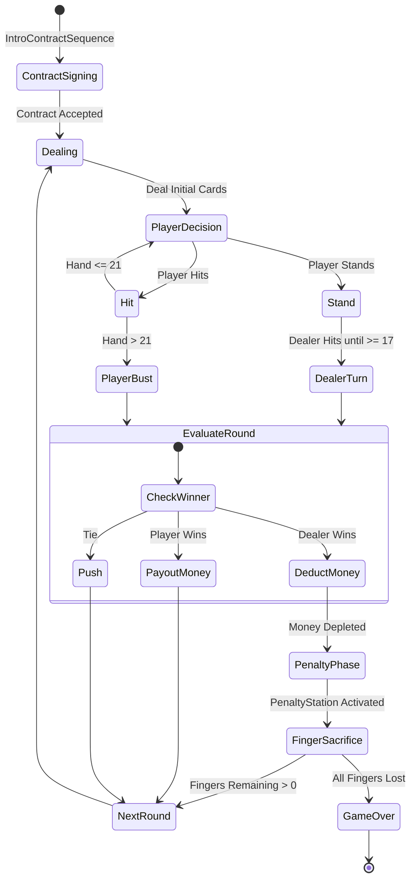

# A Finger of Luck — Moroccan Psychological Card Horror

[](https://yassir001.itch.io/a-finger-of-luck)
[](https://unity.com/)
[-blue?style=for-the-badge)](https://unity.com/srp/universal-render-pipeline)
[](https://yassir001.itch.io/a-finger-of-luck)

> *"In a dimly lit backroom, an enigmatic dealer deals the cards. Money is only the starting bet—when your pockets run dry, the table demands your fingers."*

**A Finger of Luck** (*Moroccan Blackjack*) is a tension-filled psychological card horror game that reimagines classic 21 with high-stakes physiological consequences (inspired by *Inscryption* and *Buckshot Roulette*). 

Trapped in a grim Moroccan den, players face off against a merciless dealer in a deadly game of Blackjack where the currency is debt, blood, and physical sacrifice.

🎮 **[Play on itch.io](https://yassir001.itch.io/a-finger-of-luck)**

---

## 🎲 Core Mechanics & Features

* **High-Stakes Penalty System (`FingerHealthController.cs`)**:
  * Running out of dirhams forces the player to wager their fingers.
  * Losing rounds triggers the **Penalty Station**, forcing visceral, irreversible choices.
* **Complex Blackjack State Machine (`BlackjackGame.cs`)**:
  * Full dealer AI logic adhering to standard and house rules (dealer stands on 17, soft/hard hand calculation, dynamic bust detection).
  * Seamless transitions between `Dealing`, `PlayerTurn`, `DealerTurn`, `OutcomeEvaluation`, and `PenaltyPhase`.
* **Atmospheric Blood Contract Intro (`IntroContractSequence.cs`)**:
  * Interactive pre-game sequence where the player signs a binding paper contract to begin the session.
* **Cinematic Camera Director (`BlackjackCameraDirector.cs`)**:
  * Dynamic camera cuts framing player hands, dealer gaze, tension zooms, and penalty station executions.
* **Dynamic 3D Money & Debt Visualizer (`MoneyStackManager.cs`, `DebtHUD.cs`)**:
  * Real-time 3D stacks of banknotes and coins dynamically adjust based on active bets and winnings.
* **Sinister Dealer Dialogue (`DealerDialogueSequence.cs`)**:
  * Context-aware lines reacting to lucky draws, risky hits, player hesitations, and fatal busts.
* **Gritty VHS Aesthetic**:
  * Custom URP post-processing filter providing tape noise, lens distortion, and gloomy claustrophobic lighting.

---

## 🏗️ Technical Architecture



---

## 📁 Repository Structure

```
Assets/
├── Scripts/
│   ├── BlackjackGame.cs               # Central game loop & card state machine (24KB)
│   ├── FingerHealthController.cs      # Player finger count & damage tracking
│   ├── PenaltyStation.cs              # Penalty station interaction & trigger
│   ├── IntroContractSequence.cs       # Contract signing intro controller
│   ├── DealerDialogueSequence.cs      # Dialogue trees & dealer reaction states
│   ├── BlackjackCameraDirector.cs     # Cinematic focus and camera angle switching
│   ├── MoneyStackManager.cs           # Procedural 3D money stack visualizer
│   ├── DebtHUD.cs                     # HUD elements displaying debt & cash
│   ├── Card.cs / CardVisual.cs        # Card data structures & 3D flipping animations
│   ├── Deck.cs                        # Shuffling, drawing & shoe management
│   ├── Hand.cs                        # Hand score evaluation (Aces 1 or 11)
│   └── MobilePerformanceOptimizer.cs  # Draw call & texture memory optimizer
└── Fears to Fathom Vhs for URP/       # Custom VHS tape distortion shader & feature
```

---

## 🎮 How to Play

1. **Sign the Contract**: Accept the terms laid out by the dealer.
2. **Place Your Bet**: Manage your bankroll cautiously.
3. **Card Decisions**:
   * **Hit**: Request another card to get closer to 21.
   * **Stand**: Lock in your current total and let the dealer draw.
4. **Beware the Bust**: Exceeding 21 automatically surrenders the round.
5. **Survive the Penalty**: If your funds hit zero, prepare to lose a finger at the penalty table.

---

## 💻 Unity Project Setup

### Requirements
* Unity 6 (6000.0+) or Unity 2022.3 LTS.
* Universal Render Pipeline (URP).

### Setup
1. Clone the repository:
   ```bash
   git clone https://github.com/Yassir-Essabbahy/Moroccan_Blackjack_Unity.git
   ```
2. Open the project in **Unity Hub**.
3. Load `Assets/Scenes/MainTableScene.unity`.
4. Press **Play** in the Unity Editor to experience the game.

---

## 👨‍💻 Author

**Yassir ESSABAHY**  
* Solo Indie Game Developer & 3D Artist  
* itch.io: [yassir001.itch.io](https://yassir001.itch.io/)  
* Portfolio: [yessirdev.vercel.app](https://yessirdev.vercel.app)  
* LinkedIn: [linkedin.com/in/yessir001](https://www.linkedin.com/in/yessir001/)  
* Instagram: [@thats_yessir](https://www.instagram.com/thats_yessir)
